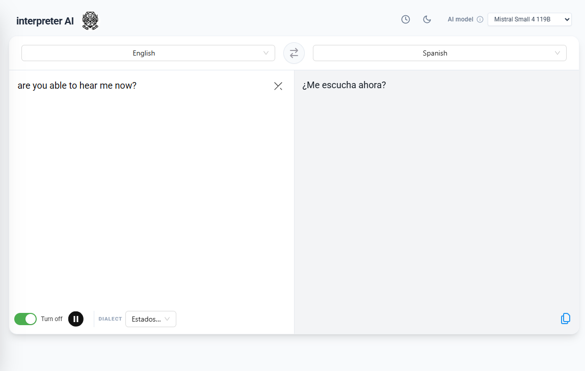
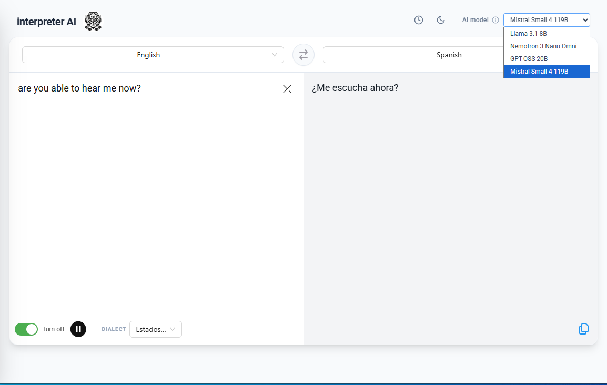
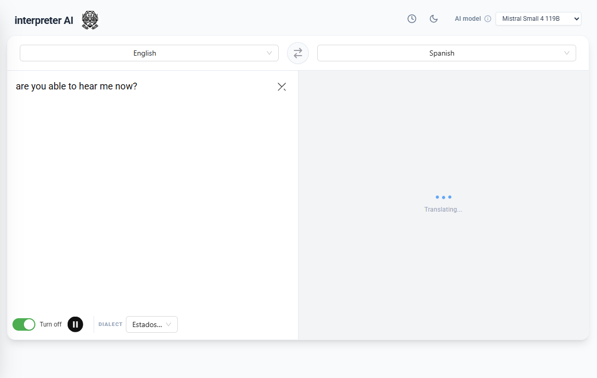

# AI Translator

## 🛠️ Technology Stack


# Setup env node

Windows
```
$ set NODE_OPTIONS=--openssl-legacy-provider
```
Linux
```
$ export NODE_OPTIONS=--openssl-legacy-provider
```

# Install dependencies
```
$ cd AI-translator
$ pnpm install
```
## Start APP
```
$ pnpm start
```

# Run Build
```
$ pnpm run build
$ pnpm install -g serve
$ serve -s build
```

# Demo Screenshots

## UI-1



## UI-2



## UI-3


